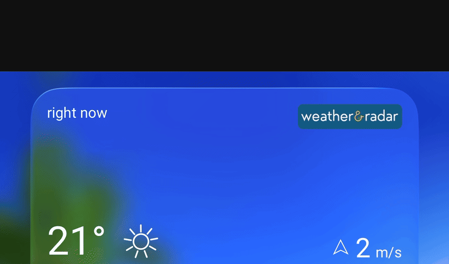

# reply-push-v2 — Free edition

Native iOS push notifications for OpenClaw, delivered to the **official App Store app** (no PWA install).



> **This is the FREE edition: it pushes one category — `agentFinished` (an agent finishes a turn).**
> The **Pro** edition adds the other 4 categories (questions, mentions, scheduled-task failures, subagent failures).
> Pro is a separate paid edition distributed on Gumroad — search for **reply-push-v2** there.

## Free vs Pro

| Category | Free | Pro |
|---|:--:|:--:|
| `agentFinished` — an agent finished a turn | ✅ | ✅ |
| `agentQuestion` — an agent asks you something (ask_user) | — | ✅ |
| `humanMentioned` — you are mentioned in a conversation | — | ✅ |
| `scheduledTaskFailed` — a cron/scheduled task failed | — | ✅ |
| `subagentFailed` — a subagent ended with error/timeout/kill | — | ✅ |
| Pro extras: agent allowlist, custom mention regex, priority support | — | ✅ |

## What you get (Free)
- Native APNs notification on your iPhone when an agent finishes its response.
- Auto-detected paired iPhone node (iPhone preferred over Apple Watch) — **zero config** for a single-device setup.
- Respects `NIGHT_MODE` (stays silent at night).
- 15-second per-category dedupe.

## Requirements
- OpenClaw Gateway (with plugin support).
- Official OpenClaw iOS app (App Store), paired and approved with your Gateway.
- iOS notifications enabled for the app.
- The hosted OpenClaw push relay (`ios-push-relay.openclaw.ai`) must be reachable — your Gateway holds no APNs keys. **iOS only** (no Android).

## Install (approx. 2 minutes)
1. Unzip into `~/.openclaw/plugins/reply-push-v2/`
2. In `~/.openclaw/openclaw.json` add the plugin to `plugins.load.paths` and enable its conversation hooks:
   ```json
   "reply-push-v2": { "enabled": true, "hooks": { "allowConversationAccess": true } }
   ```
   (`hooks.allowConversationAccess:true` is required, otherwise OpenClaw blocks the `agent_end` hook.)
3. Restart the Gateway, then confirm with: `openclaw plugins list`
4. On load you will see: `[reply-push-v2] FREE edition: agentFinished only. Pro (all 5 categories): Gumroad - search "reply-push-v2"`

## Test it
Ask your agent to do something. When it finishes, you should get a native `OpenClaw agent finished` push on the lock screen.

## Upgrading to Pro
Get all 5 categories (plus allowlist / custom mention regex): Pro is a paid edition on Gumroad (search for **reply-push-v2**), $5, instant download.

## License
MIT — this free edition may be used, modified and redistributed freely. The Pro edition ships under a separate commercial license.
